# OpenMaita

COEIROINK で琵音マイタのナレーションを作るための Windows アプリ **OpenMaita** です。

マイタの音声パックも、同じダウンロードページから配布しています。

## ダウンロード

| 項目 | 入手先 |
|------|--------|
| COEIROINK 本体 | [https://coeiroink.com/download](https://coeiroink.com/download) |
| OpenMaita アプリ（Windows） | [ダウンロードページ](https://github.com/Arpeggio39/MaitaCOEIROINK/releases) の `OpenMaita-Setup-{version}.exe` |
| 琵音マイタ 音声パック | 同上の `bionmaita-{version}.zip` |

最新の音声パックは [ダウンロードページ](https://github.com/Arpeggio39/MaitaCOEIROINK/releases) の **OpenMaita x.y.z** から取得できます（アプリと同じページにあります）。

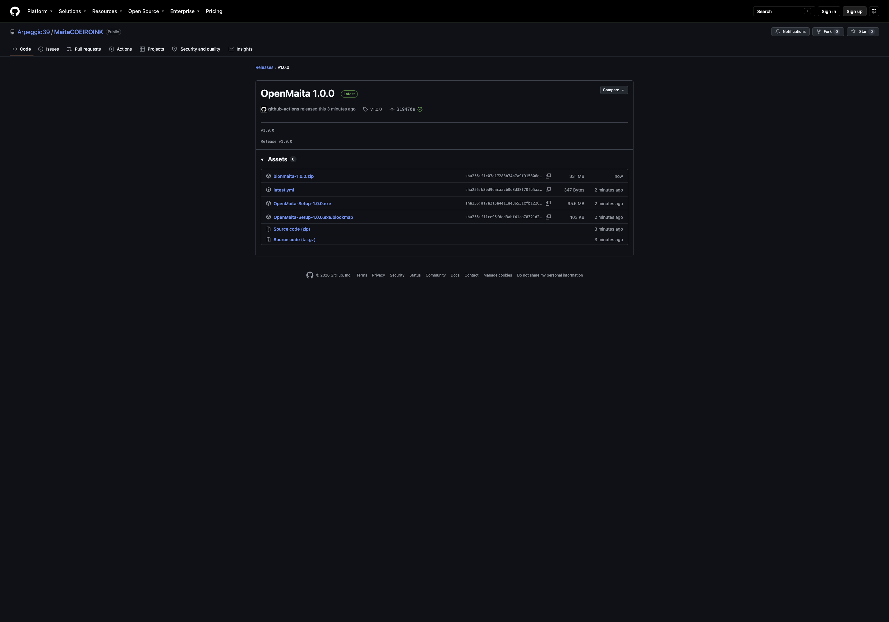

---

# COEIROINKで琵音マイタに歌ってもらおう

開発者：にっしー  
声：六素先輩

## COEIROINKとは？

人間（六素先輩）の声をAIが学習し、まるで本人が喋っているかのような流暢さでAIに歌ってもらうことができるソフトウェアです！

> ⚠️ 自由に日本語を喋ってもらうことは可能ですが...もちろん悪用ダメゼッタイ...☠️

あくまでナレーション特化なので、UTAUのマイタとは声の雰囲気が異なります...👀

## COEIROINKソフトウェアのダウンロード

[https://coeiroink.com/download](https://coeiroink.com/download)

Windows PC で **NVIDIA のグラボ** を積んでいる場合は **GPU 版** をインストールしましょう。

（COEIROINK は内部で **深層学習という AI 技術** をがっつり使っています！なので NVIDIA グラボがあると処理時間が大幅に短縮されます！）

Mac で M シリーズチップを使っている場合は Apple Silicon 版をインストールしましょう。Intel 版より処理が速いです。

では、インストールしていきましょう。

※ この解説作成時に用いたにっしーの PC 環境は以下の通りです。

- Windows：Windows 11 25H2
- Mac：macOS Tahoe 26.1

## Windowsでインストールする

（MacOS での手順は後半にあります）

### ① 解凍したフォルダーにある exe 実行

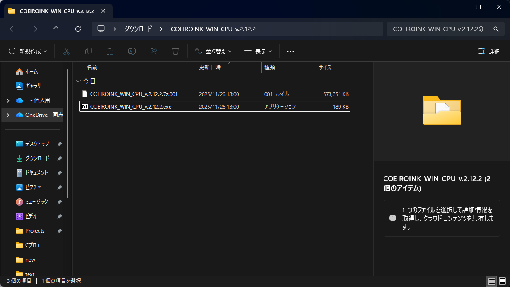

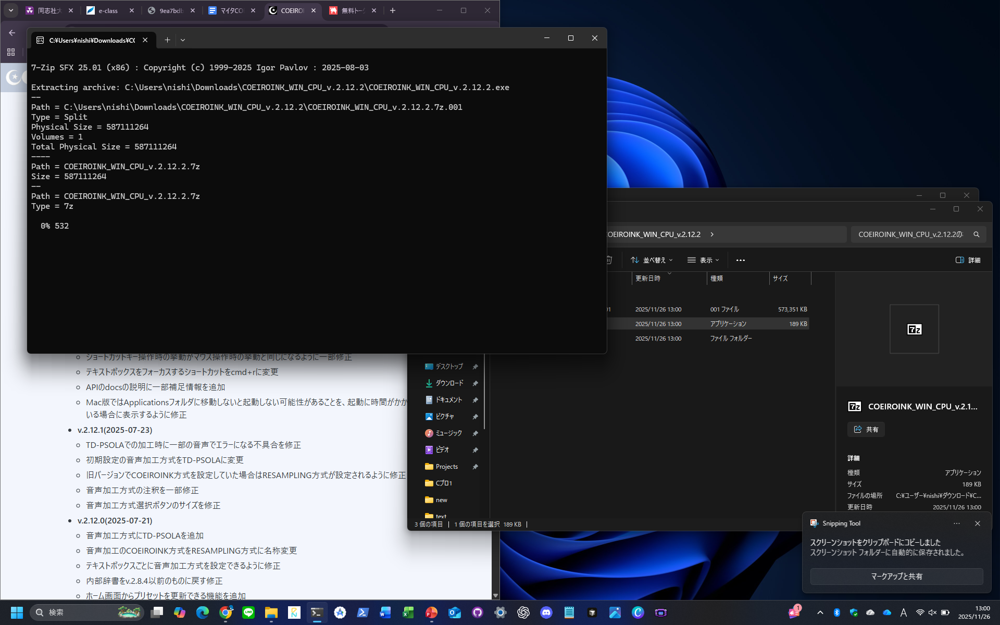

### ② 同じフォルダーに追加でダウンロードされた黄色のフォルダーを開いておいてください。後で使います

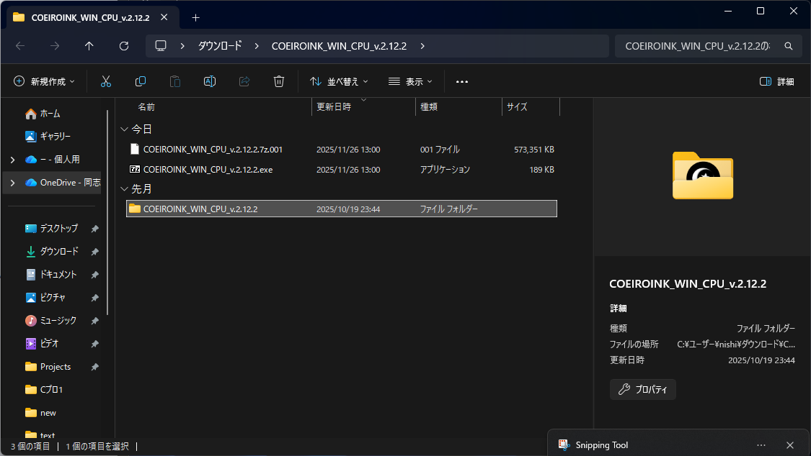

### ③ 琵音マイタ 音声パックをダウンロード

[ダウンロードページ](https://github.com/Arpeggio39/MaitaCOEIROINK/releases) から **`bionmaita-{version}.zip`** をダウンロードします（例: `bionmaita-1.0.0.zip`）。アプリと同じページにあります。


ZIP を解凍すると、中に **`bionmaita-{version}`** フォルダーが入っています（例: `bionmaita-1.0.0/`）。

### ④ speaker_info フォルダーにコピー

次に、② で開いておいた COEIROINK インストールフォルダー内の **`speaker_info` フォルダー** を開いてください。

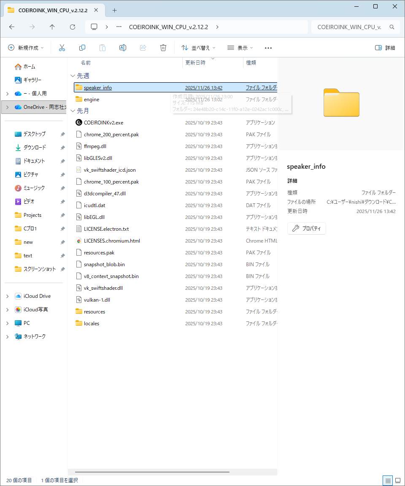

先ほど GitHub からダウンロードして解凍した **`bionmaita-{version}`** フォルダーを、**`speaker_info` フォルダー内** に移動してください。

ちなみに、元から「つくよみちゃん」というモデルもありますが、これは残してても消しても大丈夫です。

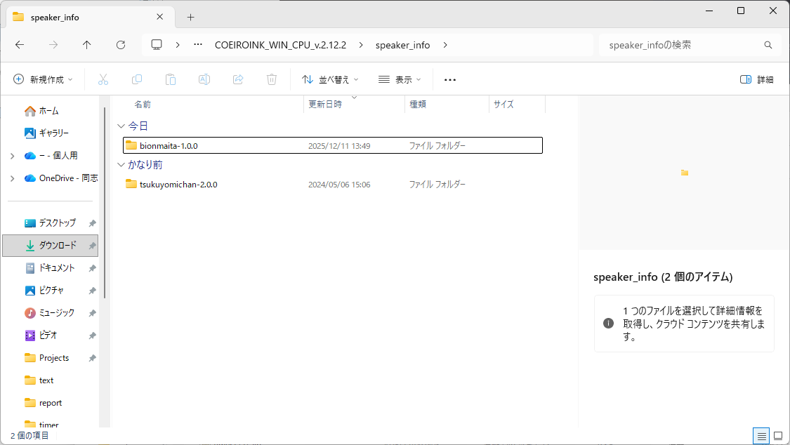

これでマイタのモデルをインストールできました！。

### ⑤ COEIROINK を起動

1 つ戻ったところにある exe を実行しましょう。

> COEIROINKv2.exe はこのフォルダーの外に移動してはいけません

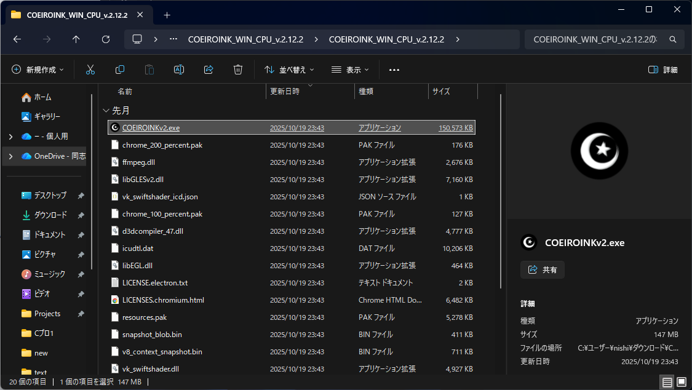

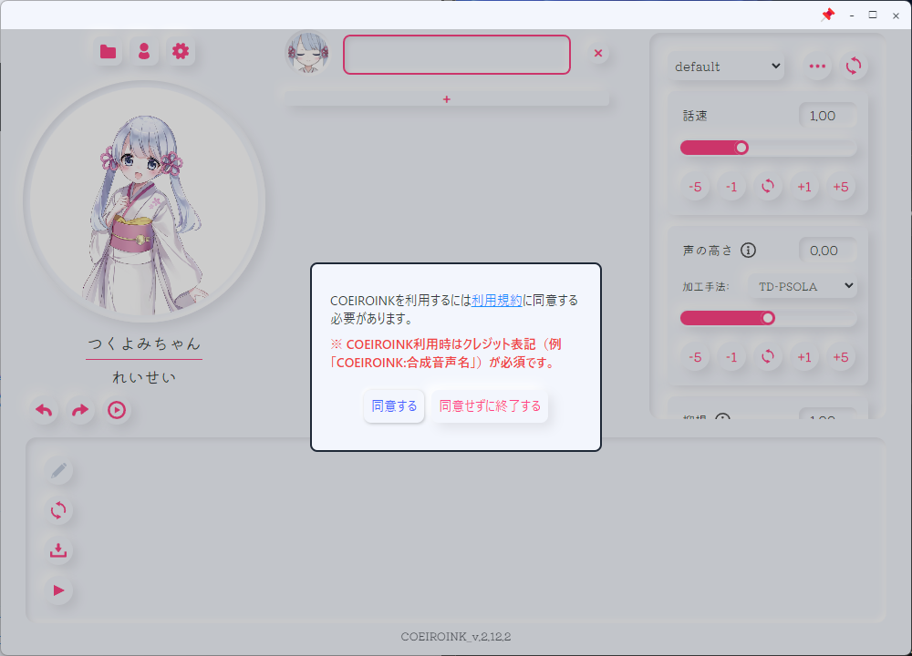

起動できました！！

中央上にあるツクヨミちゃんのアイコンを押すと、マイタに切り替えられます。

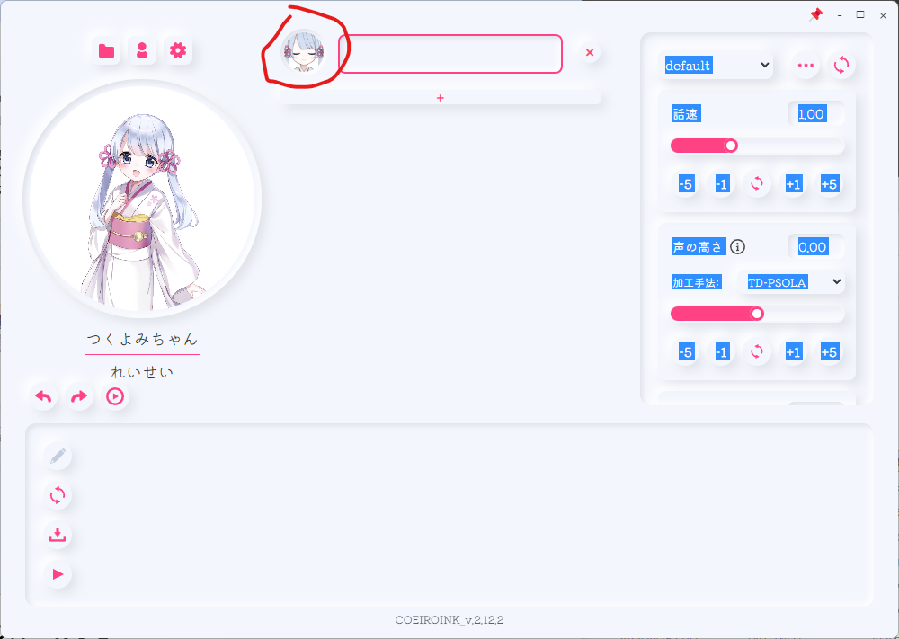

切り替わりました！これで準備完了です！マイタでナレーションをどんどん作りましょう！

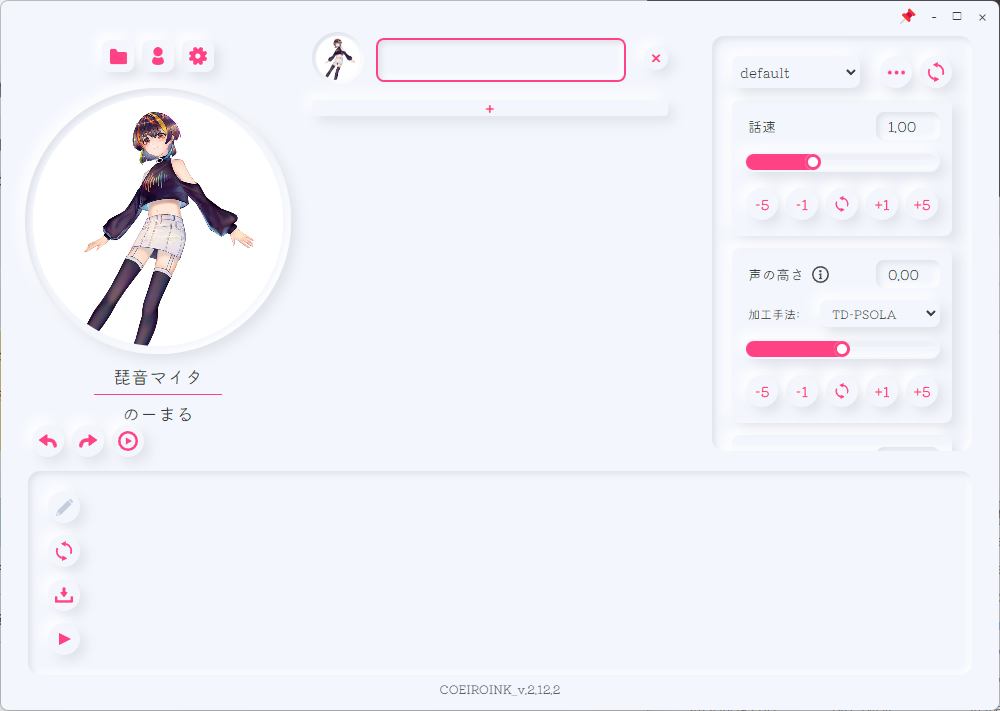

## Macでインストールする

### ① COEIROINK の HP からダウンロードした zip ファイルを解凍する

### ② .app ファイルを（Finder サイドバーにある）アプリケーションフォルダーに移動する（←必ずする！）

### ③ LaunchPad から起動する

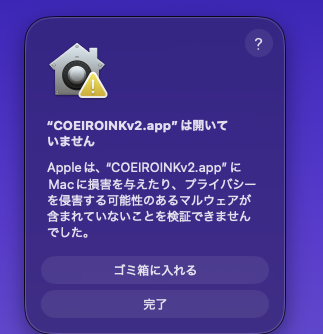

…🤨🤨🤨🤨🤨

設定 → プライバシーとセキュリティ → お使いの Mac ～ のところで「このまま開く」を押しましょう。

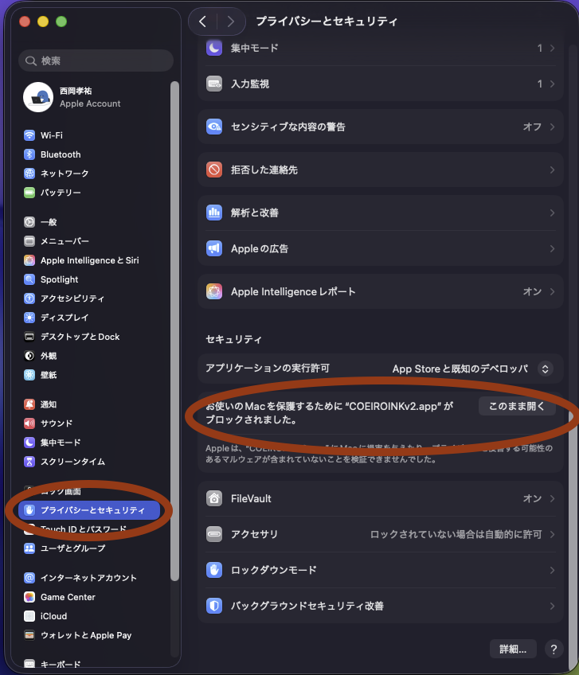

そうすると...

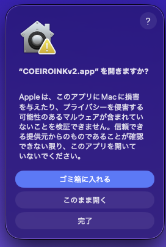

開けました！！

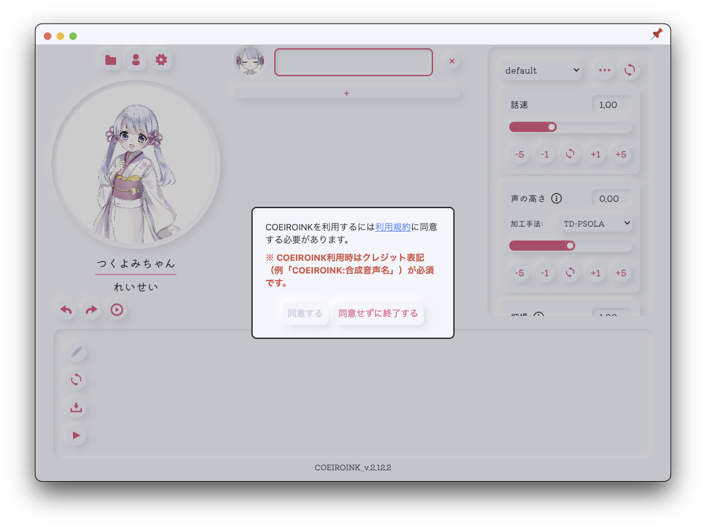

### ④ 琵音マイタ 音声パックをダウンロード

[ダウンロードページ](https://github.com/Arpeggio39/MaitaCOEIROINK/releases) から **`bionmaita-{version}.zip`** をダウンロードして展開してください（例: `bionmaita-1.0.0.zip`）。アプリと同じページにあります。

ZIP を解凍すると、中に **`bionmaita-{version}`** フォルダーが入っています（例: `bionmaita-1.0.0/`）。

### ⑤ speaker_info にコピー

次に、Finder サイドバーにある **アプリケーション** にある COEIROINKv2.app で、2 本指クリックしてメニューにある「パッケージの内容を表示」し、**`Contents/MacOS/speaker_info`** に **`bionmaita-{version}`** フォルダーを移行する。

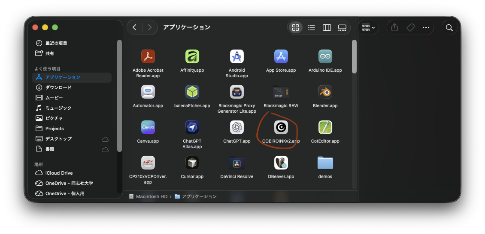

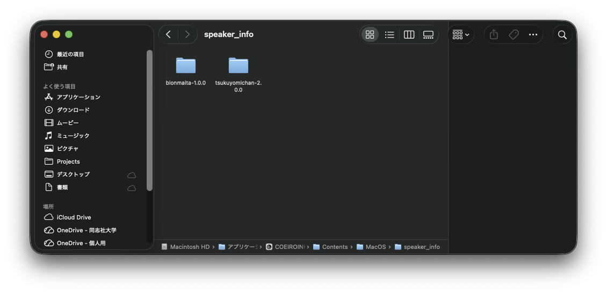

では、早速 COEIROINK を起動しましょう！

中央上にあるツクヨミちゃんのアイコンを押すと、マイタに切り替えられます。

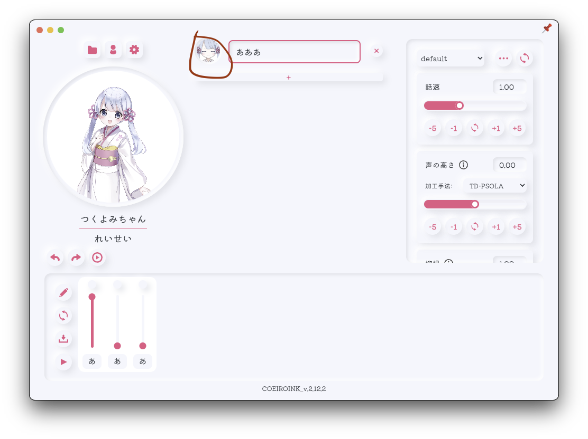

切り替わりました！これで準備完了です！マイタでナレーションをどんどん作りましょう！

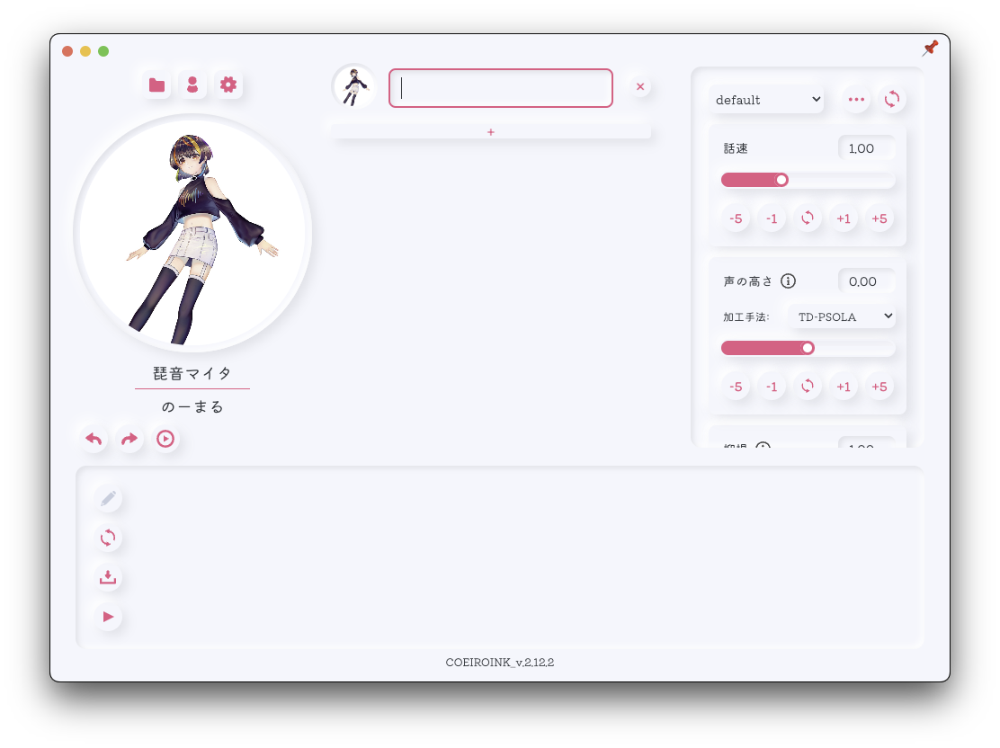

---

## 開発者向け

### バージョン管理

OpenMaita アプリと音声パックは、**`package.json` の version** で統一管理します。

- **原則として Release は 0.1 刻み**（例: `1.0.0` → `1.1.0` → `1.2.0`）で上げます
- 同じバージョンの Release が既にある状態で main に push すると、CI が自動で minor を 1 つ上げてからビルドします
- `bionmaita/**` だけを変更した場合、アプリの Release 処理（exe ビルド）は起動しません
- 音声パックの ZIP は、同じ `v*` タグの OpenMaita Release にアップロードされます
- exe を公開したときに、その Release が GitHub の **Latest** に設定されます（自動更新の検知に必要）
- アプリの Release には、毎回 **`bionmaita-{version}.zip`** も同梱されます

### 音声パックの配布形式

- リポジトリ内のフォルダ名は **`bionmaita/`**（バージョン番号なし）
- バージョンは **`package.json`** と同じ値を使用
- CI が Release 用 ZIP を **`bionmaita-{version}.zip`** として公開（中身のルートフォルダ名は `bionmaita-{version}/`）
- モデル重み（`.pth`）は Git LFS 管理

### ローカル開発

```bash
npm install
npm start
```

### Release

| 対象 | トリガー | タグ例 |
|------|----------|--------|
| OpenMaita アプリ（exe） | main への push（`bionmaita/**` 以外） | `v1.0.0` → 次回 `v1.1.0`（Release名: `OpenMaita 1.1.0`、exe と音声パック ZIP を同時公開） |
| bionmaita 音声パック | `bionmaita/**` の変更を main に push、または Actions から手動実行 | 同上の `v*` Release に ZIP を追加 |

音声パックを手動リリースする場合は、GitHub Actions の **Release Voice Pack** ワークフローから実行します。既定では `bump: minor`（0.1 刻み）が選ばれます。同じバージョンの ZIP だけ差し替える場合は `bump: none` を選び、`force` で上書きアップロードできます。例外的に `patch` / `major` も選べます。

Git LFS を使う場合は、初回 push 前に `git lfs install` を実行してください。
